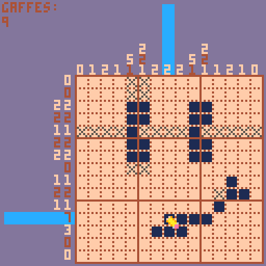

# OH, NO! (nogram)

This is a [Pico-8](https://www.lexaloffle.com/pico-8.php) implementation of the [Nonogram Puzzle](https://en.wikipedia.org/wiki/Nonogram).

It's playable [here](https://ajbowen249.github.io/oh_no_nogram/)! _Note that it is currently in a very early state. See instructions below._

Basic gameplay is functional, but the following items remain outstanding:

- ☐ Menu Zhuzh
- ☐ More than 2 basic puzzles
- ☐ Tutorial
- ☐ Hints
- ☐ Sound Effects
- ☐ Music

## Instructions

Each row and column has the list of contiguous cells to punch in order to form the image, or `0` if no cells in the row or column should be punched. Punch all the correct cells to win!

Controls:
- ⬅️➡️⬆️⬇️ Navigate cells
- 🅾️ "Mark" selected cell - Marking does not count toward score; use it to track the game however you like.
- ❎ "Punch" selected cell - Punching a cell that aught not to be punched will cost a Gaffe. Lose all your Gaffes, and it's game over!

## Building

A basic Python script called `build` handles the build process. It will require `pillow` version `11.1.0`, per the `requirements.txt`. Running `./build` will process the puzzle image files under `puzzles` into a file that Pico-8 can work with, and will also export a web build of the game. Pass `--clean` to delete the `out` folder, or `--no-export` to skip the web export.
