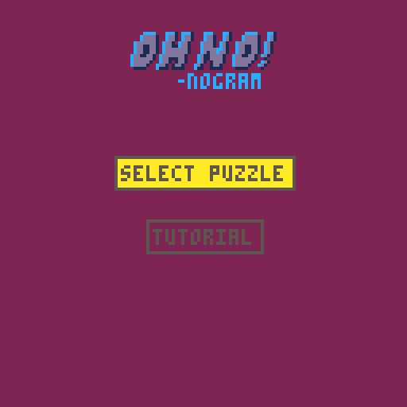

# OH, NO! (nogram)

This is a [Pico-8](https://www.lexaloffle.com/pico-8.php) implementation of the [Nonogram Puzzle](https://en.wikipedia.org/wiki/Nonogram).

Basic gameplay is functional, but the following items remain outstanding:

- ☐ Menu Zhuzh
- ☐ More than 2 basic puzzles
- ☐ Tutorial
- ☐ Sound Effects
- ☐ Music

